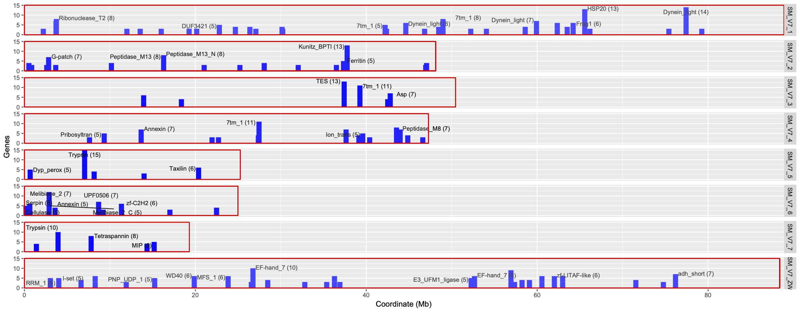
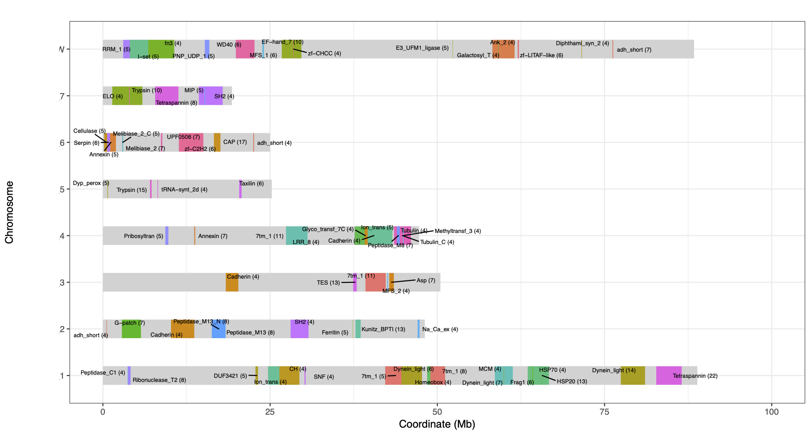

# Chrom_Functional_Clusters
A little script to find enriched functional clusters (pfam/ipr/gene family etc) on chromosomes, eg. fist to make 50-gene blocks, and test in each block functional enrichment compared to all genes.

## Input files

#### 1. gene-chr-start.txt	(gene chromosome start_coord (only for chromosomes))

**!!!sorted by chr and coord**

~~~~~~
Smp_329140 SM_V7_1 88327
Smp_315690 SM_V7_1 103403
Smp_317470 SM_V7_1 256087
~~~~~~

#### 2. gene-func.txt (gene and domain ids separated by ,)

~~~~~~
Smp_000020	PF07555
Smp_000040	PF13374,PF13424
Smp_000050	PF00520
~~~~~~

#### 3. func-names.txt (domain id and name)

~~~~~~
PF00001	7tm_1
PF00002	7tm_2
~~~~~~

#### 4. chr-length.txt (chromosome lengths for plotting, seprated by " ")

~~~~~~
SM_V7_1 88881357
SM_V7_2 48130368
...
~~~~~~

## 1. Enrichment without sliding windows

To get significantly enriched clusters for each block, run 

    ./getClusters_nonSliding.sh [WINDOWSIZE]

#### Output files:

- fisher_enriched_nonsliding.txt (significant clusters on each chromosome)
- plot_func-clusters_nonsliding.txt (Significantly enriched functions: FDR<0.05, at least 3 genes)
- plot_func-clusters_nonsliding.txt.pdf (chromosome plots with significant clusters)

## 2. Enrichment with sliding windows

Using 50-gene window with stepping 5-genes. Run 

    ./getClusters_Sliding.sh [WINDOWSIZE] [STEPSIZE]

#### Output files:

- fisher_enriched_raw.txt (raw test results for all functions and all blocks: overlapping exists) 
- fisher_enriched_sliding.txt (significant clusters on each chromosome)
- plot_func-clusters_sliding.txt (Significantly enriched functions: FDR<0.05, at least 3 genes)
- plot_func-clusters_sliding.txt.pdf (chromosome plots with significant clusters)

Note that the current script is not perfect to choose the cluster with most genes. Duplicate clusters may exist and several clusters of the same function may exist but not picked. Suggest to run the non-sliding approach for a reference. 

## Output plots

- 3-cluster_geneCounts.R: plot the gene counts in each cluster as a bar

- 4-cluster_geneCoord.R: plot clusters with start coordinates of the first and last genes. Shown as coloured blocks.

